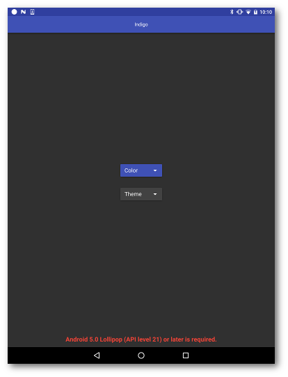

# StatusBar
A simple StatusBar implementation that allows setting the status bar
color (5.0 Lollipop or later) and theme (6.0 Marshmallow or later) on
Android.

## Build

The easiest way to include `StatusBar` to a project is to copy over the
contents of the `src` folder and include `statusbar.pri` in the project
file (see [example/statusbar.pro](example/statusbar.pro)):

    include(path/to/statusbar.pri)

## Register

Registering the QML type in C++ (see [example/main.cpp](example/main.cpp)):

    #include "statusbar.h"
    
    int main(int argc, char* argv[])
    {
        QGuiApplication app(argc, argv);

        qmlRegisterType<StatusBar>("StatusBar", 0, 1, "StatusBar"); // <==

        QQmlApplicationEngine engine;
        engine.load(QUrl(QStringLiteral("qrc:/main.qml")));
        
        return app.exec();
    }

## Usage

Example usage in QML (see [example/main.qml](example/main.qml)):

    import StatusBar 0.1

    StatusBar {
        theme: StatusBar.Dark // or Material.Dark
        color: Material.color(Material.Indigo, Material.Shade700)
    }

*NOTE: Requires Android 5.0 Lollipop (API level 21) or later.*
